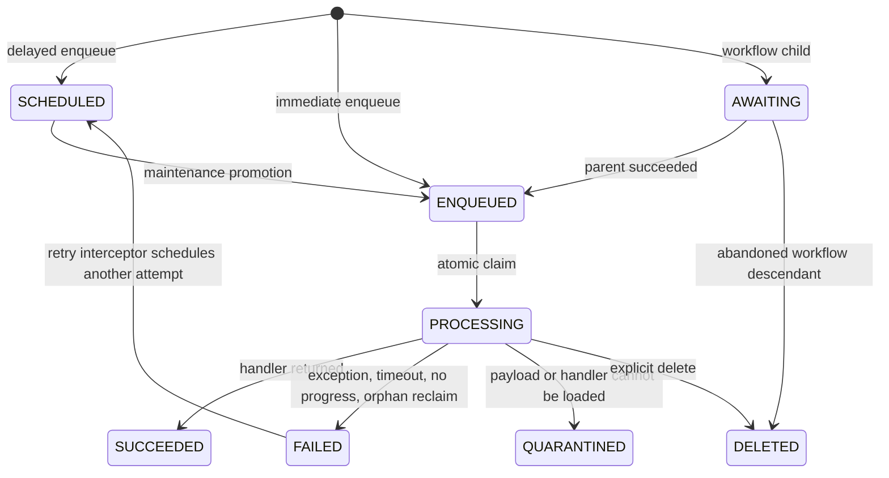
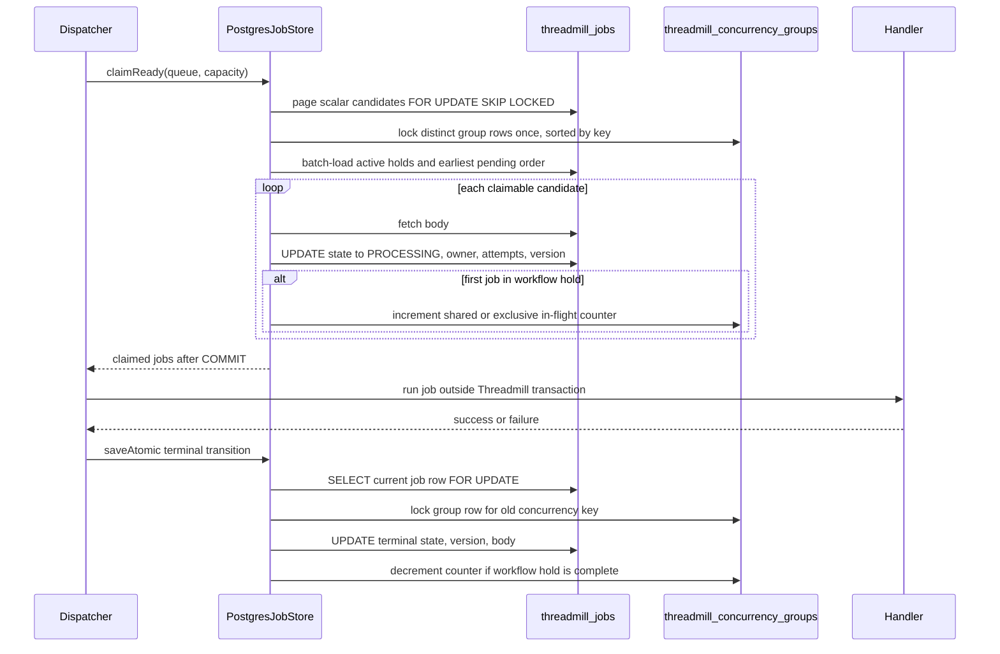
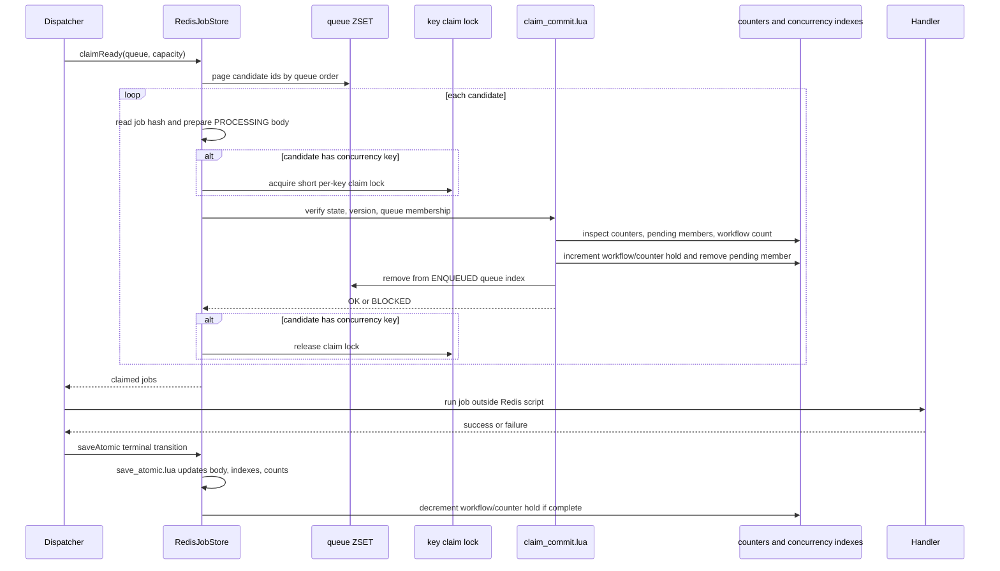

# Backend Execution Model

This is the mental model for how Threadmill moves a job through Postgres and
Redis under parallel workers. It explains where the atomic boundary is, which
state transitions are visible to other nodes, and where concurrency and
starvation protections live.

Threadmill gives at-least-once delivery. A job can run more than once after a
crash, timeout, orphan reclaim, or retry. The execution model prevents
double-claim and same-key overlap; it does not make handler side effects
exactly once.

## Job State Shape

Only `ENQUEUED` jobs are claimed by a dispatcher. `SCHEDULED` jobs must first
be promoted by maintenance, and `AWAITING` workflow jobs must first be promoted
by `WorkflowInterceptor`.

For per-key concurrency, Threadmill treats `ENQUEUED`, `SCHEDULED`, and
`AWAITING` as pending. That matters because a later reader must not leapfrog an
earlier writer just because the writer is still scheduled or waiting on a
workflow predecessor.

Within one concurrency key, pending order is total: first by `current_state_at`,
then by `JobId`. Priority chooses which queue candidates are inspected first,
but it does not let later same-key work bypass earlier same-key work.

The handler runs only while the job is `PROCESSING`. Threadmill commits the
claim before calling user code, and opens a separate save operation after user
code returns or fails.

## Per-Key Claim Rule

For a job with `concurrencyKey = K`:

- `SHARED` can claim when no `EXCLUSIVE` job is currently `PROCESSING` for `K`
  and no earlier pending `EXCLUSIVE` job exists for `K`.
- `EXCLUSIVE` can claim when no job is currently `PROCESSING` for `K` and no
  earlier pending job exists for `K`.

The second rule is deliberately strict for `EXCLUSIVE`: it keeps in-key order
stable and avoids a writer jumping ahead of earlier pending work for the same
resource.

Workflow children inherit the root job's key and mode. A workflow root owns one
hold for the whole workflow, and the hold is released only when the last
descendant reaches a release state: `SUCCEEDED`, `FAILED`, `DELETED`, or
`QUARANTINED`. A retry is a later, separate `FAILED -> SCHEDULED` transition;
that next attempt must acquire the key again.

## Postgres Path

Postgres uses normal row-level database locking. The queue decision and the
state write happen in one JDBC transaction; the handler never runs inside that
transaction.

### Postgres Parallelism

- Different queues can be claimed by different dispatchers and lanes.
- Different candidates in the same queue are protected by
  `FOR UPDATE SKIP LOCKED`, so competing nodes skip rows already being claimed.
- A blocked hot-key page does not end the claim. Postgres keeps paging by
  queue order until it fills the claim batch or exhausts the queue.
- Claim decisions are scalar-first: group counters, active workflow holds, and
  earliest pending order are loaded once per page, and job bodies are fetched
  only for candidates that will actually claim.
- Different concurrency keys mostly proceed independently.
- The same concurrency key serializes through the group row lock while a claim
  or release decision is made.
- User handlers do not hold queue row locks, so long-running jobs do not block
  unrelated claims.

Postgres can still build a backlog when offered more work than the local
database, connection pool, worker count, or queue topology can drain. A growing
queue with passing concurrency invariants is a capacity signal, not by itself a
same-key correctness failure.

## Redis Path

Redis uses server-side Lua scripts as the atomic boundary. Java may inspect
candidate hashes before the claim, but the final decision is made inside
`claim_commit.lua`.

The short per-key claim lock is not the logical concurrency hold. It only
serializes the claim decision for one key while Java prepares and submits the
Lua commit. The durable scheduling state is the job hash plus the per-key
counter, pending, workflow-count, and active workflow-hold structures. If a
client races or the lock expires, the Lua script still verifies the job
version, current state, queue membership, and key counters before it can move
anything to `PROCESSING`.

All Redis engine keys live under the `{threadmill}` slot, so the scripts update
the job body, active-state indexes, counts, concurrency counters, pending
members, workflow counts, and workflow holds atomically on one Redis Cluster
slot.

### Redis Parallelism

- Redis executes one script at a time, so each claim or save is internally
  serial.
- Multiple Java dispatchers can scan candidates concurrently, but only a Lua
  script can commit a claim.
- A blocked hot-key page does not end the claim. Redis keeps paging through the
  queue ZSET until it fills the claim batch or exhausts the queue.
- Different concurrency keys avoid logical interference, although they still
  share one Redis server execution lane.
- The same concurrency key is additionally serialized by the per-key claim
  lock while claim preparation is in progress.
- Workflow outstanding counts are maintained incrementally in a separate hash;
  the active workflow-hold hash only means "this workflow currently owns the
  key."
- Handlers run outside Redis scripts, so a slow handler does not block Redis
  from serving claims or saves.

Redis usually has lower local claim latency than Postgres because the claim
decision is a small in-memory script instead of a SQL transaction with row
locks, indexes, and connection-pool scheduling. That is a performance profile,
not a different correctness contract.

## Bookkeeping Paths

The diagrams show the hot claim and save path. The same concurrency bookkeeping
also applies to the quieter mutation paths:

- `insert`, `insertAll`, and `enqueueIfAbsent` add keyed pending jobs to the
  pending structure when their state is `ENQUEUED`, `SCHEDULED`, or `AWAITING`.
  Redis keyed inserts take the short per-key claim lock before updating
  workflow bookkeeping, so they cannot race a same-key claim that is preparing
  the first workflow hold. Redis also increments the separate workflow-count
  hash for keyed non-terminal jobs.
- Workflow child insertion inherits the parent's `workflow_root_id`,
  `concurrencyKey`, and `ConcurrencyMode`. If the root hold is already active,
  the workflow outstanding count is incremented.
- `replaceJob` moves a pending job between old and new pending structures when
  the replacement changes the queue, scheduled time, key, or mode.
- `saveAtomic` removes old pending membership, adds new pending membership when
  a retry or workflow promotion creates pending work, and releases active holds
  on release-state transitions. Redis decrements workflow counts when a keyed
  job becomes terminal and increments them when a terminal job re-enters a
  pending state for retry.
- `softDelete` removes active or pending indexes and releases the hold when a
  `PROCESSING` job is deleted.

## Starvation And Fairness

Threadmill handles the starvation cases that would break correctness:

- A stream of `SHARED` jobs cannot starve an earlier pending `EXCLUSIVE` job
  for the same key.
- An `EXCLUSIVE` job cannot run beside any other job for the same key.
- Workflow descendants cannot release the key early; the root hold survives
  until the workflow is terminal.
- Orphan reclaim, timeouts, thrown exceptions, and quarantine all release
  through the same persisted transition path.
- Queue-family stride scheduling smooths dispatch across matched queues inside
  one lane, and a zero weight pauses a queue in that family.

Threadmill does not promise:

- Global FIFO across different queues.
- A latency bound when offered load is above backend or worker capacity.
- Per-queue rate limiting.
- Exactly-once handler side effects.
- Fairness between unrelated applications sharing the same datastore.

## Race Checklist

Use this checklist when reasoning about a production incident or a soak result:

1. Did two nodes claim the same job? The expected protection is job version,
   state, and queue membership verification inside the atomic claim boundary.
2. Did two incompatible jobs for the same key run together? The expected
   protection is the Postgres group row or Redis per-key counter and workflow
   hold.
3. Did a writer wait behind later readers? The expected protection is the
   earlier-pending check for `SHARED` candidates.
4. Did a workflow release the key before its children ended? The expected
   protection is the workflow-root outstanding count.
5. Did the queue grow while invariants held? Treat that first as capacity,
   pool sizing, lane topology, or workload-shape pressure.
6. Did a key stay blocked after failure? Check that the job left `PROCESSING`
   through the normal save path and that descendants were promoted or abandoned
   as expected.
